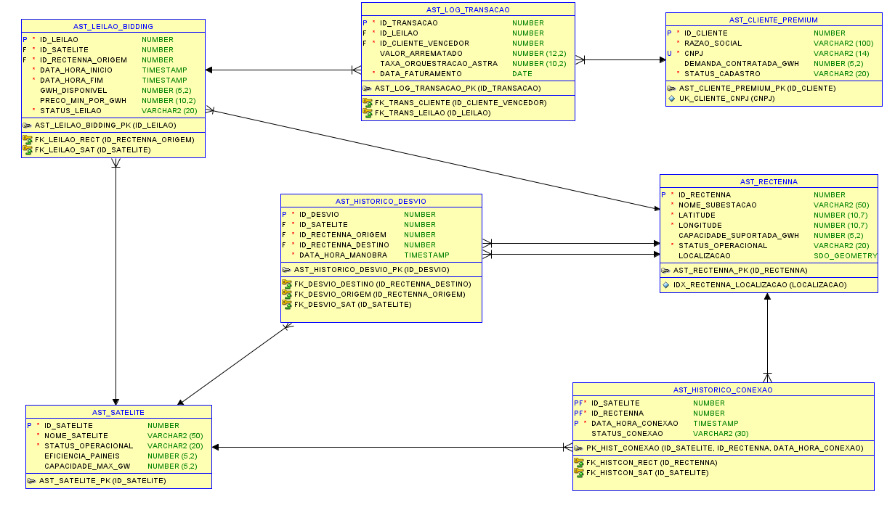

# Astra AI - Plataforma de Orquestração de Energia Solar Espacial (SBSP)


---

## 1. Visão Geral do Projeto

O **Astra AI** é uma plataforma B2B de inteligência preditiva que atua como o "sistema nervoso central" para a infraestrutura de **Energia Solar Baseada no Espaço (SBSP)**. O foco do projeto não é construir satélites, mas sim fornecer a camada de software essencial para resolver dois grandes gargalos da transmissão de energia do espaço para a Terra: as limitações da malha elétrica analógica terrestre e a atenuação do sinal de micro-ondas causada por tempestades severas.

Este repositório contém o **microsserviço Java (Spring Boot)**, que é o coração da infraestrutura de validação climática e roteamento.

---

## 2. Links Essenciais

| Recurso                    | Link                                                                                             |
| -------------------------- | ------------------------------------------------------------------------------------------------ |
| 🚀 **Deploy da Aplicação** | *<ins>http://astraia.canadacentral.cloudapp.azure.com:8080</ins>*                                          |
| 📄 **Documentação (Swagger)** | *<ins>http://astraia.canadacentral.cloudapp.azure.com:8080/swagger-ui/index.html</ins>*  |
| 🎬 **Vídeo Pitch (3 min)**   | *<ins>https://youtu.be/o6ouhoeTxm8</ins>*                                                 |
| 🎥 **Vídeo Demo (10 min)**   | *<ins>https://youtu.be/Co9nFV1C9V0</ins>*                                       |

---

## 3. Principais Funcionalidades Implementadas

### Gerenciamento de Satélites
- **Cadastro de Satélite**: Registra um novo satélite na malha orbital.
  - `POST /satelites`
- **Listagem de Satélites**: Retorna a lista paginada de todos os satélites, com filtro opcional por status.
  - `GET /satelites`
- **Consulta de Satélite por ID**: Busca um satélite específico.
  - `GET /satelites/{id}`
- **Atualização de Satélite**: Modifica os dados de um satélite existente.
  - `PUT /satelites/{id}`
- **Descomissionamento de Satélite**: Remove um satélite da frota ativa.
  - `DELETE /satelites/{id}`

### Gerenciamento de Rectennas
- **Cadastro de Rectenna**: Adiciona uma nova subestação receptora na Terra.
  - `POST /rectennas`
- **Listagem de Rectennas**: Retorna a lista paginada de todas as subestações.
  - `GET /rectennas`
- **Consulta de Rectenna por ID**: Busca uma subestação específica.
  - `GET /rectennas/{id}`
- **Atualização de Rectenna**: Modifica os dados de uma subestação.
  - `PUT /rectennas/{id}`
- **Desativação de Rectenna**: Desativa (soft delete) uma subestação do sistema, alterando seu status operacional para "Inativa".
  - `DELETE /rectennas/{id}`

### Orquestração de Telemetria e Atuadores
- **Validação de Feixe de Energia**: Endpoint central que recebe a telemetria do hardware (IoT), valida as condições climáticas, decide se mantém a conexão ou se redireciona o feixe, e retorna o comando final para o atuador.
  - `POST /telemetria/validar-feixe`

### Auditoria e Histórico
- **Consulta ao Histórico de Desvios**: Retorna um log paginado de todas as manobras de redirecionamento de energia que ocorreram devido a contingências.
  - `GET /historico-desvios`

---

## 4. Arquitetura e Organização do Código

O projeto foi estruturado seguindo os princípios da **Arquitetura em Camadas (Layered Architecture)** para garantir a separação de responsabilidades, coesão e baixo acoplamento entre os componentes.

- **`controllers`**: Camada de entrada da API. Responsável por expor os endpoints REST, receber as requisições HTTP, validar os dados de entrada (DTOs) e delegar a execução para a camada de serviço.
- **`services`**: Onde reside a lógica de negócio principal da aplicação. Orquestra as operações, consome outros serviços e repositórios, e trata das regras de negócio.
- **`repositories`**: Camada de acesso a dados. Interfaces que estendem o `JpaRepository` do Spring Data JPA para abstrair a comunicação com o banco de dados.
- **`models`**: As entidades JPA que mapeiam as tabelas do banco de dados (ex: `Satelite`, `Rectenna`).
- **`dtos`**: (Data Transfer Objects) Objetos (Records) simples e imutáveis usados para transferir dados entre as camadas, especialmente entre controllers e services, e para formatar os payloads de requisição e resposta.
- **`clients`**: Interfaces declarativas (HTTP Interfaces) para a comunicação com APIs externas (OpenWeather).
- **`exceptions` e `validation`**: Pacotes que contêm o handler de exceções global (`@RestControllerAdvice`) e classes de validação personalizadas.
- **`config`**: Classes de configuração do Spring, como a que registra os beans dos clientes HTTP.

---

## 5. Dependências Principais

- **Spring Boot Starter Web**: Para a criação de APIs REST.
- **Spring Boot Starter Data JPA**: Para a persistência de dados com o padrão ORM.
- **Oracle Driver (ojdbc11)**: Driver JDBC para conexão com o banco de dados Oracle.
- **Spring Boot Starter Validation**: Para validações dos DTOs de entrada.
- **Springdoc OpenAPI**: Para a geração automática da documentação Swagger.
- **Lombok**: Para reduzir código boilerplate (getters, setters, construtores).

---

## 6. Modelagem de Dados

A persistência de dados é realizada em um banco de dados **Oracle**, e o mapeamento objeto-relacional é gerenciado pelo **Spring Data JPA**. As principais tabelas utilizadas por esta API são:

- **`AST_SATELITE`**: Armazena os dados da frota de satélites.
- **`AST_RECTENNA`**: Armazena os dados das subestações terrestres.
- **`AST_HISTORICO_CONEXAO`**: Tabela de auditoria que registra cada conexão estabelecida ou tentada.
- **`AST_HISTORICO_DESVIO`**: Tabela de log para todas as manobras de redirecionamento de energia.

### Diagrama Entidade-Relacionamento (DER)



### Explanação dos Relacionamentos

- **`HistoricoDesvio`**: Possui relacionamentos `ManyToOne` com `Satelite` e dois com `Rectenna` (para diferenciar a origem e o destino), refletindo que um satélite ou rectenna pode estar envolvido em múltiplos desvios.
- **`HistoricoConexao`**: Implementa o requisito de **Modelagem Avançada** com uma **Chave Primária Composta** (`@EmbeddedId`), formada pelos IDs do satélite, da rectenna e a data/hora. Também possui relacionamentos `ManyToOne` com `Satelite` e `Rectenna`.

---

## 7. Exemplos de Requisições e Respostas

### Validar Feixe de Energia

- **Requisição**: `POST /telemetria/validar-feixe`
  ```json
  {
    "sateliteId": 1,
    "rectennaId": 1,
    "leituraSensor": 450
  }
  ```
- **Resposta (Cenário de Redirecionamento)**:
  ```json
  {
    "comando": "REDIRECIONAR",
    "destinoId": 2
  }
  ```

### Cadastrar uma nova Rectenna

- **Requisição**: `POST /rectennas`
  ```json
  {
    "nomeSubestacao": "Rectenna de Teste",
    "latitude": -23.550520,
    "longitude": -46.633308,
    "capacidadeSuportadaGwh": 150.00,
    "statusOperacional": "Ativa"
  }
  ```
- **Resposta**: `201 Created`
  ```json
  {
    "idRectenna": 3,
    "nomeSubestacao": "Rectenna de Teste",
    "latitude": -23.550520,
    "longitude": -46.633308,
    "capacidadeSuportadaGwh": 150.00,
    "statusOperacional": "Ativa"
  }
  ```

### Listar Histórico de Desvios

- **Requisição**: `GET /historico-desvios?page=0&size=5&sort=dataHoraManobra,desc`
- **Resposta**: `200 OK`
  ```json
  {
    "content": [
      {
        "idDesvio": 1,
        "idSatelite": 1,
        "nomeSatelite": "Astra-01",
        "idRectennaOrigem": 1,
        "nomeRectennaOrigem": "São Paulo",
        "idRectennaDestino": 2,
        "nomeRectennaDestino": "Campinas",
        "dataHoraManobra": "2024-05-21T10:30:00"
      }
    ],
    "pageable": { ... },
    "totalElements": 1,
    "totalPages": 1,
    "last": true,
    ...
  }
  ```

---

## 8. Como Executar o Projeto Localmente

### Pré-requisitos
- JDK 21 ou superior
- Maven 3.8 ou superior
- Acesso a uma instância do Oracle Database

### Passos para Execução

1. **Clone o repositório:**
   ```bash
   git clone https://github.com/Global-Solution-2026-Astra-Ai/Astra-Ai-Java
   ```

2. **Configure o Banco de Dados:**
   - Abra o arquivo `src/main/resources/application.properties`.
   - Altere as seguintes propriedades para corresponder às suas credenciais do Oracle DB:
     ```properties
     spring.datasource.url=jdbc:oracle:thin:@//<SEU_HOST>:<SUA_PORTA>/<SEU_SERVICE_NAME>
     spring.datasource.username=<SEU_USUARIO>
     spring.datasource.password=<SUA_SENHA>
     ```
   - Para configurar o banco de dados, execute os scripts SQL na pasta `docs/data/` na seguinte ordem:
     1. `ddl/criacao_tabelas.sql`: Cria a estrutura de tabelas e sequências.
     2. `packages/pkg_gestao_conexoes.sql`: Compila a function e a procedure do projeto.
     3. `triggers/*.sql`: Cria os gatilhos de auditoria.
     4. `dml/carga_dados.sql`: Insere os dados iniciais para teste.

3. **Configure as Chaves de API:**
   - No mesmo arquivo `application.properties`, insira sua chave da API OpenWeather:
     ```properties
     api.clima.key=<SUA_CHAVE_OPENWEATHER_API>
     ```

4. **Execute a aplicação:**
   ```bash
   mvn spring-boot:run
   ```
   A API estará disponível em `http://localhost:8080`.

---

## 9. Referências Científicas

* ALAM, K. S. et al. Towards net zero: A technological review on the potential of space-based solar power and wireless power transmission. *Heliyon*, v. 10  e29996, 2024.
* CHE, X. et al. Assess Space-Based Solar Power in European-Scale Power System Decarbonization. 2024.
* MIZRAHI, O. S. et al. Space solar power generation: A viable system proposal and technoeconomic analysis. *Joule*, v. 9, 101928, 2025.
* PELHAM, T.; FEARON, T. C. A Scalable open-source electromagnetics model for Wireless power transfer and Space-Based Solar Power. In: URSI International Symposium on Electromagnetic Theory (EMTS). Bologna, Itália, 2025.
* QAID, K. A.; ÇELIK, O.; MCINNES, C. R. Space-Based Solar Power: Optimal Integration of Orbiting Solar Reflectors in Power Grids for Economic and Environmental Benefits. In: IEEE ISGT Europe 2025. Valletta, Malta, 2025.
* RAMALA, S. K. R.; GARZANITI, N. A feasibility study on space-based solar power for lunar economy. In: AIAA Aviation Forum and Ascend 2025. Las Vegas, EUA, 2025.

---

## 10. Integrantes do Grupo

- *<ins>Arthur Graciani Bezerra — RM561728</ins>*
- *<ins>Gustavo Pinheiro de Oliveira - RM566358</ins>*
- *<ins>João Pedro Scarpin de Assis Carvalho - RM565421</ins>*
- *<ins>Lucas Hideki Penha Suguiura de Souza - RM565355</ins>*
- *<ins>Wesley Silva de Andrade - RM563593</ins>*